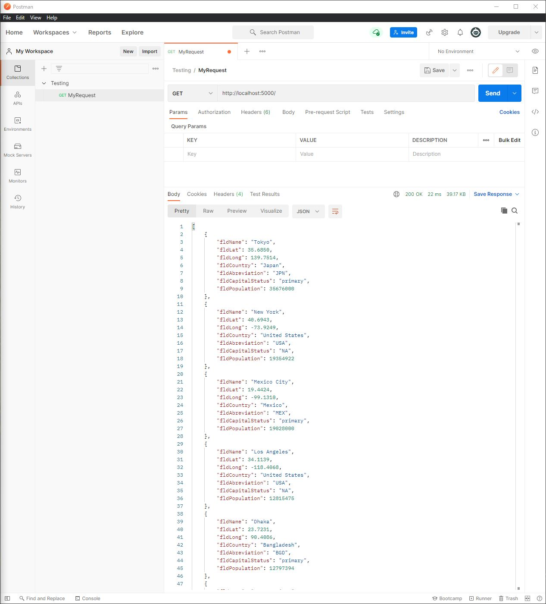
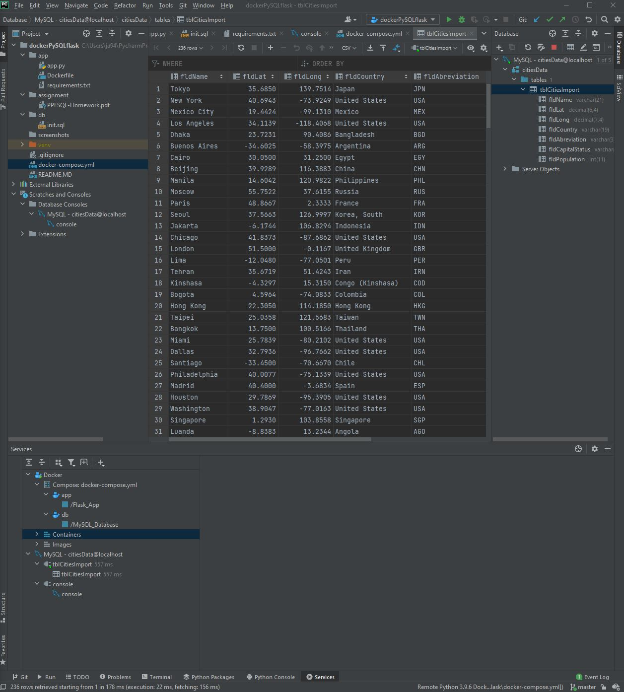

# Project Description
This project is homework assignment to teach how to get Pycharm setup woth Docker, Flask, MySQL

[Download Assignment Here](assignment/PPFSQL-Homework.pdf)  
[View Assignment Video Here](https://www.youtube.com/watch?v=QbMWNgrfAFg)
# Postman Screenshot

# SQL Data Screenshot

